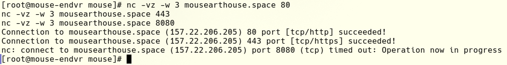

# Readme for the test task repo

## обо мне
Меня зовут Полина, я DevOps-инженер. В процессе обучения в вузе удалось попробовать разные направления: frontend, backend, мобильная разработка, QA, аналитика. Среди изучаемых предметов больше всего понравились основы компьютерного администрирования и кибербезопасность. Сначала мне просто понравилось работать с Linux и терминалом: было интересно самостоятельно разбираться, как устроена система и почему она работает именно так. Со временем интерес перерос в желание понимать уже не отдельные компоненты, а то, как они взаимодействуют между собой, и как можно сделать лучше для конкретных случаев. 
Сейчас в направлении DevOps мне нравится сочетание технической глубины и работы с архитектурой. Мне интересно не только написать или настроить что-то конкретное, но и подумать о том, как построить систему целиком: как она будет разворачиваться, масштабироваться, мониториться и, главное, восстанавливаться при проблемах. Кроме того, мне нравится, что работа DevOps-инженера находится на стыке разработки и инфраструктуры и позволяет видеть проект на более высоком уровне, чем это могут делать разработчики, поэтому постепенно я поняла, что именно это направление мне хочется развивать дальше. 
Профессиональный интерес начал потихоньку становиться любимым делом. Если к началу первого курса я знала python на уровне ЕГЭ и как включать компьютер, то теперь я представляю, как работают сервисы в разных сферах - благодаря прочитанным статьям и просмотренным докладам от сотрудников разных компаний. Еще второй системой на личном ноутбуке теперь является линукс, и это очень классный опыт.

## о решении задания
Результат можно увидеть на https://mousearthouse.space
Я решила использовать Ansible + GitHub actions для решения почти всего задания, потому что, во-первых, переиспользуемость это здорово, а во-вторых, так я точно могу быть уверена, что прошлась по всем шагам и сделала именно то, что требовалось 
1. Скачиваются нужные apt-пакеты. Устанавливается nginx, поскольку в apt-пакетах не нашлось нужной версии, он скачивается из репозитория. В папку /var/www/html копируется файл index.html - это сама страничка, которая будет хоститься. Копируется конфиг nginx и сервер запускается 
2. В конфиге прописано, что на 80 порту хостится сайт. В html-файлике написано "Hello DevOps world" 
3. Файерволл устанавливается UFW как самый базовый, в роли ansible/roles/ufw/tasks/main.yml прописаны правила для него. Доступны 80, 22, 443 порты, для остальных доступа нет - при попытке постучаться случается таймаут
 
4. На страничке выводится текущее время - оно зависит от таймзоны браузера. Скрипт для того, чтобы время менялось, я взяла с другого сайта, в index.html есть комментарий об этом 
5. Сертификаты были выписаны вручную через certbot, в конфиг nginx добавлена информация о них - теперь к страничке можно подключаться по tls
6. Бэкап настроен с помощью cron-таймера (шаблон для него лежит в ansible/roles/files/cron_template.cron.j2) и bash-скрипта (он находится в ansible/roles/files/backup_script.sh.j2) 
7. Nginx работает от пользователя nginx 
8. Для этой вм есть несколько ssh-ключей, одним из них пользуется Ansible, чтобы попасть на мою вм с GitHub actions раннера. Приватный ключ лежит в секретах репозитория, Ansible стучится на вм с помощью имя_юзера@айпи_вм и предлагает ssh-ключ. На вм заранее добавлен соответствующий публичный ключ в authorized_keys для пользователя, под которым входит ansible. Sshd сверяет ключи и разрешает войти на вм 
9. Я решила не заворачивать абсолютно все в контейнеры, потому что не вижу особой на это причины, но докерфайл лежит в репозитории 